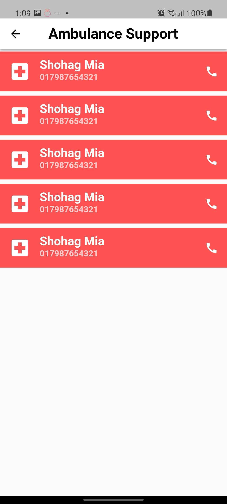

# TeliMed
Healthcare anyware anytime

## Features

 - Online Consultation With Doctors
 - Medical Services and Emergency features
 - Helpdesk and Calling feature
 - Clean & Modern User Interface
 - Both for Clinic Visit Appointments and Online Consultation
 - Items are well organized & categorized
 - and a bunch of usefull features

## Screenshots

      

## Try out ShikkhaDex?

Android: [Download TeliMed.apk](https://github.com/afjal-al-sayed/shikkha_dex/raw/master/release/shikkha_dex.apk)

## Developer

Hi there! I am Mahedi Hasan Nabil. I create CrossPlatform apps for solving problems and Bringing something Enovative to make things easier to bring something new to the society. Try out my new app TeliMed(an online doctor consultation solution). 
If you have any query related to it don't hasitate to [e-mail me](mailto:mhnabilcoder@gmail.com). And also check out my other stuffs [here](https://github.com/mhnabilcoder).
